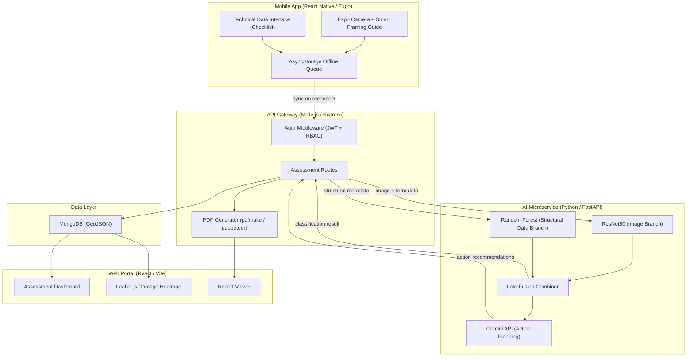
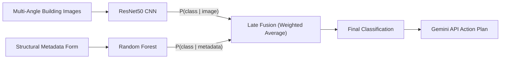

# Product Requirements Document: RAPID MVP

**Full Title:** RAPID: A Hybrid AI System for Pre-Earthquake Resilience Prediction and Post-Earthquake Damage Classification Through Image and Structural Data Integration with Automated Action Planning

**Version:** MVP 1.0
**Status:** Draft
**Date:** March 8, 2026

---

## 1. Objective

Philippine Local Government Units (LGUs) lack a unified, data-driven tool for both proactive seismic risk assessment and rapid post-earthquake damage triage. Current workflows rely on manual paper-based Rapid Visual Screening (RVS) forms, disconnected spreadsheets, and subjective expert judgment — resulting in slow response times, inconsistent evaluations, and no centralized situational awareness during disaster events.

**RAPID** solves this by unifying two established structural assessment frameworks — **FEMA P-154** (Rapid Visual Screening of Buildings for Potential Seismic Hazards) and **ATC-20** (Post-Earthquake Safety Evaluation of Buildings) — into a single multimodal AI platform. The system uses **Late Fusion** to combine a CNN image classifier (ResNet50) with a tabular data classifier (Random Forest), producing a unified risk classification. It then generates AI-powered action recommendations via the Gemini API, delivers automated PDF reports, and surfaces a real-time damage heatmap on a centralized LGU decision portal.

### Operational Phases

| Phase | Framework | Purpose | Output |
|-------|-----------|---------|--------|
| Pre-Earthquake | FEMA P-154 | Predict building vulnerability for proactive retrofitting | Risk score + retrofit recommendations |
| Post-Earthquake | ATC-20 | Triage structural damage immediately after an event | SAFE / RESTRICTED / UNSAFE classification |

---

## 2. Target Audience

### Primary Personas

#### Field Inspectors / Barangay Workers
- **Role:** Conduct on-site building assessments using the mobile app.
- **Tech Level:** Low to moderate; smartphone-literate but not technically trained.
- **Environment:** Outdoors, often in disaster-affected areas with poor or no connectivity.
- **Needs:** Simple camera-guided interface, offline data collection, automatic sync when signal returns.
- **Pain Points:** Paper forms are slow, error-prone, and easily lost; no guidance on photo angles.

#### City / Municipal Engineers
- **Role:** Review and validate AI-generated classifications from the web portal; approve or override assessments; generate official RVS reports.
- **Tech Level:** High domain expertise in structural engineering; moderate software proficiency.
- **Needs:** Detailed assessment data, confidence scores, override capability, PDF report generation.
- **Pain Points:** Manual report writing is time-consuming; no consolidated view of all assessed buildings.

#### LGU Disaster Risk Reduction Officers (DRRMO)
- **Role:** Monitor overall disaster impact and allocate inspection/response resources.
- **Tech Level:** Moderate; familiar with GIS and dashboards.
- **Needs:** Geographic heatmap of damage, priority queue of high-risk structures, exportable summaries.
- **Pain Points:** No real-time situational awareness; decisions rely on delayed radio/phone reports.

#### System Administrators
- **Role:** Manage user accounts, roles, model versions, and sync configurations.
- **Tech Level:** High technical proficiency.
- **Needs:** User management panel, audit logs, model deployment controls.

---

## 3. System Architecture

### High-Level Data Flow



### Late Fusion Pipeline Detail



The Late Fusion approach keeps the two modalities independent during training. Each model outputs a probability distribution over the classification labels. These distributions are combined via weighted averaging to produce the final prediction, which then feeds into the Gemini API for context-aware action planning.

---

## 4. Core Features

### Must Have (P0) — MVP Launch

#### 4.1 ResNet50 Image Classifier
- **Description:** A convolutional neural network (ResNet50, transfer-learned on earthquake damage imagery) that detects external structural failures — cracks, spalling, concrete crushing, leaning, partial collapse — from multi-angle building photographs.
- **User Story:** As a field inspector, I want to upload building photos so the system can automatically detect visible structural damage.
- **Acceptance Criteria:**
  - [ ] Accepts JPEG/PNG images up to 10 MB each
  - [ ] Returns per-class probability scores within 5 seconds
  - [ ] Achieves >= 85% F1 score on the validation set
  - [ ] Handles 1-4 images per assessment (multi-angle)

#### 4.2 Random Forest Structural Data Classifier
- **Description:** A tabular classifier that analyzes building metadata — age, number of stories, construction material, structural system, soil type, distance to nearest fault line, previous retrofit history — to predict seismic vulnerability.
- **User Story:** As a field inspector, I want to fill out a building data form so the system can assess structural risk from engineering parameters.
- **Acceptance Criteria:**
  - [ ] Accepts all FEMA P-154 / ATC-20 relevant fields
  - [ ] Returns classification with feature importance ranking
  - [ ] Achieves >= 80% F1 score on the validation set
  - [ ] Inference completes in under 1 second

#### 4.3 Late Fusion Multimodal Combiner
- **Description:** Merges the probability outputs of the ResNet50 and Random Forest models via weighted averaging to produce a single unified classification (Pre-EQ: Low / Moderate / High risk; Post-EQ: SAFE / RESTRICTED / UNSAFE).
- **User Story:** As an engineer, I want a single combined risk score that accounts for both visual evidence and structural data so I can make informed decisions.
- **Acceptance Criteria:**
  - [ ] Combined classification outperforms either individual model
  - [ ] Fusion weights are configurable per deployment
  - [ ] Outputs confidence score alongside the label
  - [ ] Gracefully degrades if one modality is missing (image-only or form-only)

#### 4.4 Smart Framing Guide
- **Description:** A camera overlay on the mobile app that guides field workers to capture photos at optimal angles (front facade, left side, right side, close-up of damage). Uses on-screen alignment indicators and checklist progress.
- **User Story:** As a field inspector with no photography training, I want on-screen guidance so my photos are useful for the AI classifier.
- **Acceptance Criteria:**
  - [ ] Displays overlay grid with recommended framing zones
  - [ ] Shows checklist of required angles (minimum 2 of 4)
  - [ ] Works in both portrait and landscape orientation
  - [ ] Functions fully offline

#### 4.5 Technical Data Interface
- **Description:** A structured digital form (checklist) that captures building metadata aligned with FEMA P-154 and ATC-20 fields: building use, number of stories, year built, structural system type, foundation type, soil classification, proximity to fault, visible irregularities, and prior retrofit status.
- **User Story:** As a field inspector, I want a guided digital checklist so I can record building details accurately without paper forms.
- **Acceptance Criteria:**
  - [ ] All fields have validation rules (numeric ranges, required fields, enums)
  - [ ] Supports save-as-draft for partial completion
  - [ ] Auto-fills GPS coordinates from device location
  - [ ] Works fully offline with local persistence

#### 4.6 Offline-First Mobile Data Collection
- **Description:** The mobile app stores all captured images and form data locally in AsyncStorage. A background sync service detects connectivity and uploads queued assessments to the API gateway automatically.
- **User Story:** As a field inspector working in a disaster zone with no signal, I want my data saved locally and uploaded automatically when connectivity returns.
- **Acceptance Criteria:**
  - [ ] All assessment data persists across app restarts
  - [ ] Sync resumes automatically on network reconnect
  - [ ] Conflict resolution: server timestamp wins, local copy archived
  - [ ] Sync progress indicator visible to user
  - [ ] Queue handles at least 50 pending assessments

#### 4.7 Centralized Decision Portal (Web Dashboard)
- **Description:** A React-based web application for engineers and DRRMO officers to view all assessments, filter by status/risk/location, review AI classifications, override results, and manage the inspection workflow.
- **User Story:** As a city engineer, I want a centralized dashboard so I can review all building assessments, prioritize inspections, and track progress.
- **Acceptance Criteria:**
  - [ ] Tabular assessment list with sorting and filtering
  - [ ] Detail view showing images, form data, AI classification, and confidence scores
  - [ ] Engineer override capability with mandatory justification field
  - [ ] Role-based access: Admin, Engineer, DRRMO, Field Inspector (read-only)
  - [ ] Responsive layout (desktop-first, tablet-compatible)

---

### Should Have (P1) — High Value, Post-Core

#### 4.8 Automated Action Planning (Gemini API)
- **Description:** After classification, the system sends the risk level, building metadata, and damage indicators to the Gemini API, which generates a context-aware action plan: recommended retrofitting measures (pre-EQ) or immediate safety actions and repair priorities (post-EQ).
- **User Story:** As an engineer, I want AI-generated action recommendations so I have a starting point for my retrofit or repair plan.
- **Acceptance Criteria:**
  - [ ] Generates recommendations within 10 seconds
  - [ ] Output structured as numbered action items with priority levels
  - [ ] Includes disclaimer that recommendations require professional review
  - [ ] Fallback to template-based recommendations if Gemini API is unavailable

#### 4.9 Prioritization Algorithm
- **Description:** A rule-based + ML-informed algorithm that ranks assessed buildings by urgency, factoring in risk classification, building occupancy type (school, hospital, residential), population density, and structural age. High-priority structures are flagged for immediate City Engineer inspection.
- **User Story:** As a DRRMO officer, I want buildings automatically ranked by urgency so I can deploy inspection teams to the most critical structures first.
- **Acceptance Criteria:**
  - [ ] Priority score computed on every new assessment
  - [ ] Top-N urgent buildings highlighted in dashboard
  - [ ] Sorting by priority available in assessment list
  - [ ] Notification/alert for buildings exceeding critical threshold

#### 4.10 Automated PDF RVS Reports
- **Description:** One-click generation of an official Rapid Visual Screening report in PDF format, populated with building data, photos, AI classification, confidence scores, action recommendations, and inspector/engineer metadata. Follows FEMA P-154 report structure.
- **User Story:** As a city engineer, I want to generate an official PDF report instantly so I can file it with the LGU and share with stakeholders without manual formatting.
- **Acceptance Criteria:**
  - [ ] PDF includes all assessment fields, images (thumbnails), and AI results
  - [ ] Follows FEMA P-154 report layout conventions
  - [ ] Includes digital signature placeholder and QR code for verification
  - [ ] Generates in under 15 seconds
  - [ ] Downloadable from the web portal

---

### Could Have (P2) — Future Enhancement

#### 4.11 Real-Time Damage Heatmap
- **Description:** A Leaflet.js-powered geographic visualization that plots all assessed buildings on a map, color-coded by risk/damage classification. Supports clustering at zoom levels and filtering by assessment date and classification.
- **User Story:** As a DRRMO officer, I want a geographic heatmap so I can see the spatial distribution of damage and direct resources to the hardest-hit areas.
- **Acceptance Criteria:**
  - [ ] Renders GeoJSON point data from MongoDB
  - [ ] Color-coded markers: green (SAFE/Low), yellow (RESTRICTED/Moderate), red (UNSAFE/High)
  - [ ] Cluster markers at lower zoom levels
  - [ ] Filter by date range, classification, and barangay
  - [ ] Refreshes on new assessment data (polling or WebSocket)

---

### Won't Have (This Release)

| Feature | Reason |
|---------|--------|
| Real-time seismic sensor integration | Out of thesis scope; requires hardware partnerships |
| Multi-language support (Filipino/Cebuano) | Deferred to v2; English-only for MVP |
| Public citizen reporting portal | Security and data quality concerns for MVP |
| Historical trend analysis / time-series | Requires longitudinal data not yet available |
| Native iOS/Android builds (non-Expo) | Expo managed workflow sufficient for MVP |

---

## 5. Technical Stack

| Layer | Technology | Purpose |
|-------|-----------|---------|
| Mobile App | React Native (Expo), AsyncStorage, Expo Camera | Field data collection, offline storage, photo capture |
| Web Portal | React.js (Vite), Leaflet.js, Tailwind CSS | Engineer/DRRMO dashboard, heatmap, reports |
| API Gateway | Node.js, Express.js | REST API routing, auth, request orchestration |
| PDF Generation | pdfmake / Puppeteer | Automated RVS report generation |
| Database | MongoDB (with GeoJSON indexes) | Assessment storage, geospatial queries |
| AI Microservice | Python, FastAPI | ML model serving and inference orchestration |
| Image Classifier | TensorFlow / Keras (ResNet50) | CNN-based structural damage detection |
| Tabular Classifier | Scikit-Learn (Random Forest), Pandas | Structural metadata risk classification |
| Action Planning | Google Gemini API | AI-generated retrofit/repair recommendations |
| Authentication | JWT (jsonwebtoken) | Stateless token-based auth with RBAC |

---

## 6. User Stories

### US-1: Field Assessment Workflow
> As a **field inspector**, I want to photograph a building and fill out its structural checklist on my phone — even without internet — so the data is ready for AI analysis when I'm back online.

**Flow:** Open app --> select "New Assessment" --> Smart Framing Guide activates camera --> capture 2-4 photos --> fill Technical Data Interface form --> save locally --> auto-sync when online.

### US-2: Engineer Review and Override
> As a **city engineer**, I want to review the AI's classification on the web portal, see the confidence score and supporting evidence, and override the result with a justification if I disagree.

**Flow:** Log in to portal --> view assessment list --> click assessment --> review images, form data, AI classification, confidence --> approve or override with notes --> generate PDF report.

### US-3: Disaster Situational Awareness
> As a **DRRMO officer**, I want to see a real-time heatmap of assessed buildings color-coded by damage level so I can allocate inspection teams and relief resources geographically.

**Flow:** Log in to portal --> open Heatmap view --> filter by date/classification --> identify cluster of red markers --> dispatch team to that barangay.

### US-4: Automated Action Planning
> As a **city engineer**, I want AI-generated action recommendations for each assessed building so I have a professional starting point for my retrofit or repair plan.

**Flow:** Open assessment detail --> scroll to "Action Plan" section --> review Gemini-generated recommendations --> edit/approve --> include in PDF report.

---

## 7. Non-Functional Requirements

### Performance
| Metric | Target |
|--------|--------|
| Image inference latency (ResNet50) | < 5 seconds per image |
| Tabular inference latency (Random Forest) | < 1 second |
| Late Fusion + response | < 7 seconds end-to-end |
| Gemini API action plan generation | < 10 seconds |
| PDF report generation | < 15 seconds |
| Web portal page load | < 3 seconds |
| Offline sync queue capacity | >= 50 assessments |

### Reliability
- Offline-first: mobile app must function with zero connectivity for 100% of data collection tasks.
- Sync must retry with exponential backoff on failure.
- Server uptime target: 99% (acceptable for thesis/pilot deployment).

### Security
- JWT-based authentication with role-based access control (Admin, Engineer, DRRMO, Inspector).
- Passwords hashed with bcrypt (cost factor >= 10).
- API rate limiting: 100 requests/minute per user.
- Image uploads validated for file type and size server-side.
- Environment secrets stored in `.env`, never committed to version control.

### Usability
- Mobile app: operable with one hand; large touch targets (>= 48px); high-contrast UI for outdoor use.
- Web portal: WCAG 2.1 AA compliance for color contrast and keyboard navigation.
- Smart Framing Guide: no training required; visual-only instructions.

### Scalability (MVP Scope)
- Support 50 concurrent field inspectors syncing data.
- Support 10 concurrent web portal users.
- Handle up to 10,000 building assessments in MongoDB.
- Horizontal scaling deferred to post-thesis.

---

## 8. Data Model Summary

### MongoDB Collections

#### `users`
```json
{
  "_id": "ObjectId",
  "email": "string (unique)",
  "passwordHash": "string",
  "fullName": "string",
  "role": "enum: admin | engineer | drrmo | inspector",
  "lguCode": "string",
  "createdAt": "Date",
  "updatedAt": "Date"
}
```

#### `buildings`
```json
{
  "_id": "ObjectId",
  "buildingCode": "string (unique)",
  "address": "string",
  "barangay": "string",
  "municipality": "string",
  "location": {
    "type": "Point",
    "coordinates": ["longitude", "latitude"]
  },
  "buildingUse": "enum: residential | commercial | institutional | industrial | mixed",
  "numberOfStories": "number",
  "yearBuilt": "number",
  "structuralSystem": "string",
  "foundationType": "string",
  "soilClassification": "enum: A | B | C | D | E | F",
  "distanceToFaultKm": "number",
  "previousRetrofit": "boolean",
  "createdAt": "Date",
  "updatedAt": "Date"
}
```

#### `assessments`
```json
{
  "_id": "ObjectId",
  "buildingId": "ObjectId (ref: buildings)",
  "inspectorId": "ObjectId (ref: users)",
  "phase": "enum: pre-earthquake | post-earthquake",
  "images": [
    {
      "url": "string",
      "angle": "enum: front | left | right | closeup",
      "capturedAt": "Date"
    }
  ],
  "structuralData": {
    "material": "string",
    "condition": "string",
    "irregularities": ["string"],
    "occupancyAtTime": "number"
  },
  "aiResult": {
    "imageClassification": { "label": "string", "confidence": "number", "probabilities": {} },
    "tabularClassification": { "label": "string", "confidence": "number", "featureImportance": {} },
    "fusedClassification": { "label": "string", "confidence": "number" },
    "fusionWeights": { "image": "number", "tabular": "number" }
  },
  "actionPlan": {
    "recommendations": ["string"],
    "generatedBy": "enum: gemini | template-fallback",
    "generatedAt": "Date"
  },
  "engineerReview": {
    "reviewedBy": "ObjectId (ref: users) | null",
    "overrideClassification": "string | null",
    "justification": "string | null",
    "reviewedAt": "Date | null"
  },
  "priorityScore": "number",
  "status": "enum: pending-sync | pending-review | reviewed | report-generated",
  "createdAt": "Date",
  "updatedAt": "Date"
}
```

#### `syncQueue` (Mobile-side, AsyncStorage)
```json
{
  "queueId": "uuid",
  "assessmentPayload": {},
  "imageFiles": ["base64 or file URI"],
  "attempts": "number",
  "lastAttemptAt": "Date | null",
  "status": "enum: queued | syncing | synced | failed"
}
```

### Indexes
- `buildings.location`: 2dsphere (geospatial queries)
- `assessments.buildingId`: ascending
- `assessments.phase`: ascending
- `assessments.status`: ascending
- `assessments.priorityScore`: descending
- `users.email`: unique ascending

---

## 9. API Endpoints Summary

### Authentication
| Method | Endpoint | Description |
|--------|----------|-------------|
| POST | `/api/auth/register` | Register new user (admin-only) |
| POST | `/api/auth/login` | Authenticate, return JWT |
| GET | `/api/auth/me` | Get current user profile |

### Buildings
| Method | Endpoint | Description |
|--------|----------|-------------|
| POST | `/api/buildings` | Create building record |
| GET | `/api/buildings` | List buildings (filterable by barangay, municipality) |
| GET | `/api/buildings/:id` | Get building detail |
| PUT | `/api/buildings/:id` | Update building metadata |
| GET | `/api/buildings/geojson` | Get all buildings as GeoJSON FeatureCollection |

### Assessments
| Method | Endpoint | Description |
|--------|----------|-------------|
| POST | `/api/assessments` | Submit new assessment (images + form data) |
| GET | `/api/assessments` | List assessments (filterable by phase, status, priority) |
| GET | `/api/assessments/:id` | Get assessment detail with AI results |
| PUT | `/api/assessments/:id/review` | Engineer override/approval |
| POST | `/api/assessments/:id/report` | Generate PDF report |
| GET | `/api/assessments/:id/report` | Download generated PDF |

### AI Inference (Internal — called by API Gateway)
| Method | Endpoint | Description |
|--------|----------|-------------|
| POST | `/ai/predict/image` | ResNet50 image classification |
| POST | `/ai/predict/tabular` | Random Forest tabular classification |
| POST | `/ai/predict/fused` | Full Late Fusion pipeline (image + tabular) |
| POST | `/ai/action-plan` | Gemini API action plan generation |

### Sync (Mobile)
| Method | Endpoint | Description |
|--------|----------|-------------|
| POST | `/api/sync/batch` | Batch upload queued assessments |
| GET | `/api/sync/status/:queueId` | Check sync status for a queued item |

---

## 10. Success Metrics

### Primary Metrics (Thesis Evaluation)
| Metric | Target | Measurement Method |
|--------|--------|--------------------|
| Image classifier accuracy (F1) | >= 85% | Validation set evaluation |
| Tabular classifier accuracy (F1) | >= 80% | Validation set evaluation |
| Fused model accuracy (F1) | > max(image, tabular) individually | Comparative evaluation |
| End-to-end inference latency | < 7 seconds | Timed API calls |
| Offline sync success rate | >= 95% | Sync queue completion logs |

### Secondary Metrics (Usability / Pilot)
| Metric | Target | Measurement Method |
|--------|--------|--------------------|
| Field assessment completion time | < 10 minutes per building | Timed field tests |
| System Usability Scale (SUS) score | >= 70 (acceptable) | Post-pilot survey |
| PDF report generation time | < 15 seconds | Timed API calls |
| Inspectors trained in < 30 min | >= 90% of pilot participants | Training session observation |
| Gemini action plan relevance | >= 4/5 engineer rating | Expert review scoring |

---

## 11. Risks and Mitigations

| Risk | Probability | Impact | Mitigation |
|------|------------|--------|------------|
| Low model accuracy on Philippine building stock (training data gap) | High | Critical | Augment dataset with local imagery; use transfer learning from global earthquake damage datasets; implement engineer override as safety net |
| Poor connectivity in disaster zones | High | High | Offline-first architecture with robust local storage and retry-based sync |
| Gemini API unavailability or cost overrun | Medium | Medium | Template-based fallback recommendations; set API usage caps; cache common action plans |
| Image quality variance from field conditions | High | Medium | Smart Framing Guide; server-side image quality validation; allow re-upload |
| User adoption resistance from field workers | Medium | High | Simple UI with minimal text; in-app onboarding tutorial; pilot training sessions |
| MongoDB performance at scale | Low | Medium | Proper indexing (2dsphere, compound); pagination on all list endpoints; defer sharding to post-thesis |
| Security breach / unauthorized access | Low | Critical | JWT + RBAC; input validation; rate limiting; HTTPS-only; regular dependency audits |

---

## 12. Definition of Done (MVP)

### Feature Complete
- [ ] All 7 P0 features implemented and functional
- [ ] At least 2 of 3 P1 features implemented
- [ ] Both operational phases (pre-EQ, post-EQ) testable end-to-end

### AI / ML Validation
- [ ] ResNet50 trained and evaluated with documented F1 >= 85%
- [ ] Random Forest trained and evaluated with documented F1 >= 80%
- [ ] Late Fusion demonstrated to outperform individual models
- [ ] Gemini action plan output reviewed by domain expert

### Quality Assurance
- [ ] Mobile app tested on at least 2 Android devices (offline + online scenarios)
- [ ] Web portal tested on Chrome and Firefox (latest versions)
- [ ] API endpoints tested with automated integration tests
- [ ] PDF report output validated against FEMA P-154 format expectations

### Deployment
- [ ] All services deployable via documented steps
- [ ] Environment variables documented in `.env.example`
- [ ] MongoDB seeded with sample data for demonstration
- [ ] README with setup and usage instructions

### Thesis Deliverables
- [ ] System architecture diagram included in manuscript
- [ ] Model training methodology documented
- [ ] Evaluation results (confusion matrices, F1 scores) tabulated
- [ ] Pilot test results (SUS scores, completion times) summarized
- [ ] Source code repository organized and commented

---

*PRD Version: 1.0*
*Created: March 8, 2026*
*Status: Draft — Ready for Technical Design*
